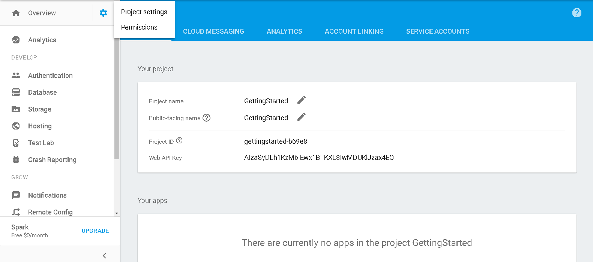
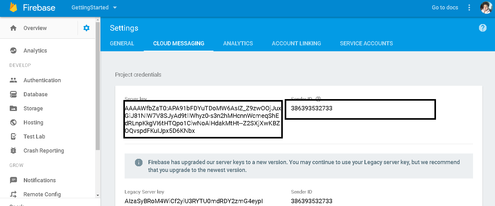

# PushNotificationIonic2

<h2>Android Setup</h2>

Android uses FCM (Firebase Cloud Messaging) which is earlier known as GCM(Google Cloud Messaging)

Firebase Cloud Messaging (FCM) is a cross-platform messaging solution that lets you reliably deliver messages at no cost.

follow these setup to get your SERVER_KEY and SENDER_ID
 

  Go to firebase console (https://firebase.google.com/) and create a new project 
  Note down your SERVER_KEY and SENDER_ID 
  

  

  
  

    
  

  
  

<strong>SERVER_KEY</strong> used by server to send push notification 

<strong>SENDER_ID</strong> used by device to generate device token 

